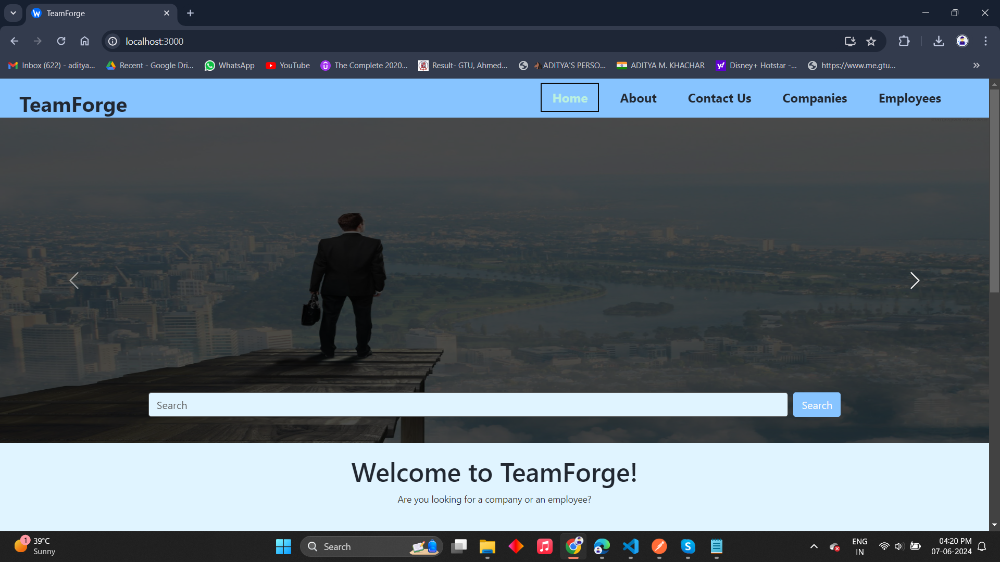
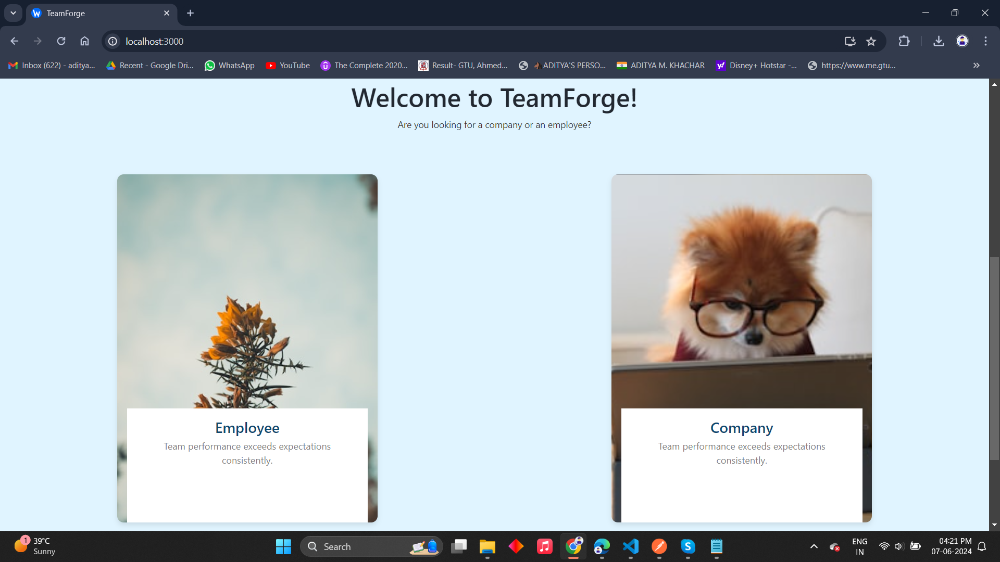
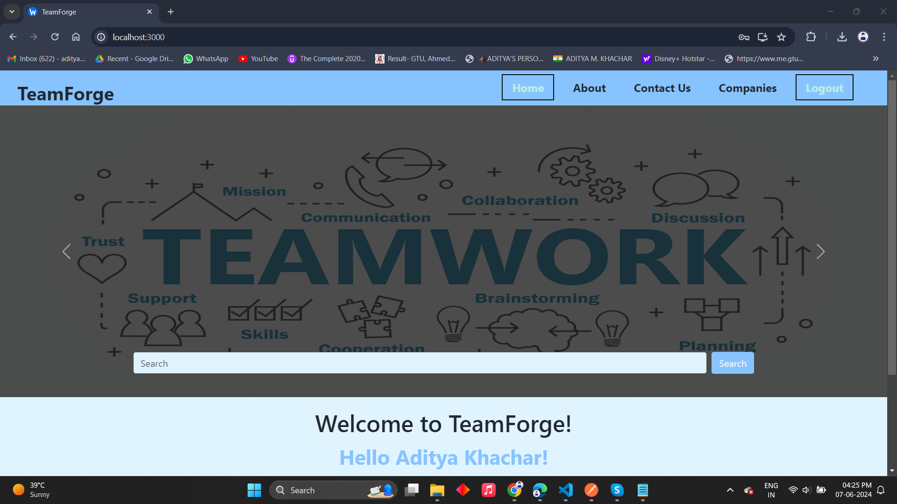
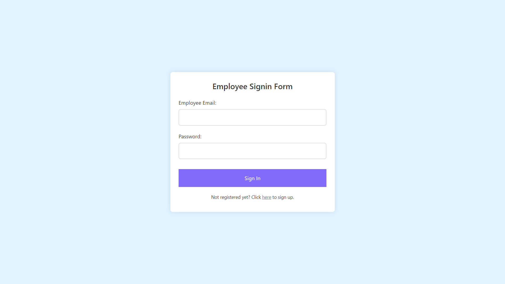
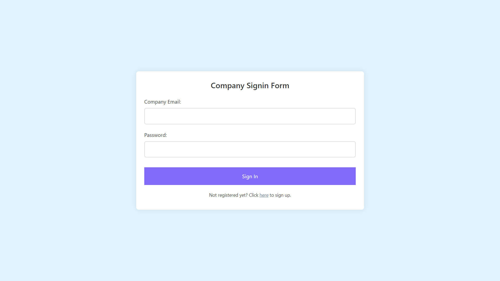
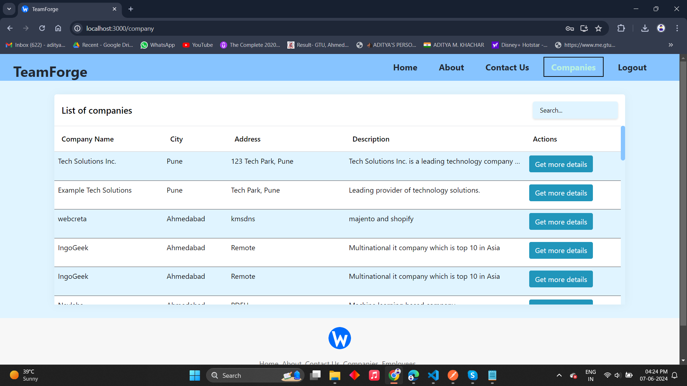
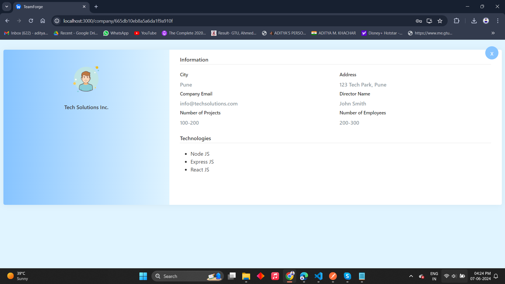
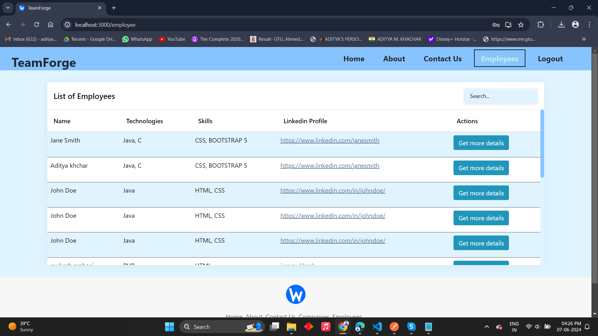
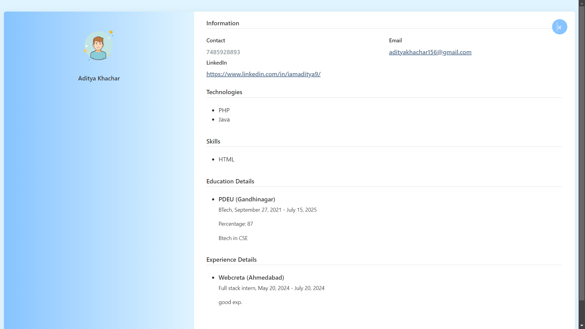

# TeamForge
A comprehensive Team Management System where employees and companies can register, view each other's details, and get in touch. This responsive web application ensures seamless interaction between job seekers and employers, accessible across various devices including mobile.

## Table of Contents
- [Installation](#installation)
- [Usage](#usage)
- [Features](#features)
- [Screenshots](#screenshots)
- [Technologies Used](#technologies-used)
- [Contributing](#contributing)
- [License](#license)

## Installation
1. Clone the repository
    ```bash
    git clone https://github.com/your-username/teamforge.git
    ```
2. Navigate to the project directory
    ```bash
    cd backend
    ```
3. Install dependencies
    ```bash
    npm install
    ```

## Screenshots

### Dashboard


### Dashboard (page 2) 


### Employee Dashboard


### Company Dashboard


### Employee Login


### Company Login


### List of Companies (Page 1)


### List of Companies (Page 2)


### List of Employees (Page 1)


### List of Employees (Page 2)


## Usage

To get the project up and running, follow these steps:

### Starting the Frontend

1. Navigate to the project directory:
    ```bash
    cd teamforge
    ```

2. Install the necessary dependencies:
    ```bash
    npm install
    ```

3. Start the frontend development server:
    ```bash
    npm start
    ```
    This will launch the frontend on `http://localhost:3000`.

### Starting the Backend

1. Navigate to the backend directory (if it's in a different folder, adjust the path accordingly):
    ```bash
    cd backend
    ```

2. Install the necessary backend dependencies:
    ```bash
    npm install
    ```

3. Start the backend server:
    ```bash
    node index.js
    ```
    This will launch the backend server on `http://localhost:5000`.

### Accessing the Application

Once both the frontend and backend servers are running, you can access the application by navigating to `http://localhost:3000` in your web browser.

### Additional Notes

- Ensure that you have [Node.js](https://nodejs.org/) installed on your machine.
- The backend server must be running for the frontend application to communicate with it.
- If you encounter any issues, check the console for error messages and ensure all dependencies are correctly installed.

## Features

### User Authentication
- **Registration**: Users can register as either an employee or a company.
- **Login**: Secure login for both employees and companies.

### Employee Functionality
- **Profile Creation**: Employees can create and manage their profiles.
- **Company Browsing**: Employees can browse and view details of registered companies.
- **Contact Companies**: Employees can get in touch with companies they are interested in.

### Company Functionality
- **Profile Creation**: Companies can create and manage their profiles.
- **Employee Browsing**: Companies can browse and view details of registered employees.
- **Contact Employees**: Companies can get in touch with potential employees.

### Dashboard
- **User-Specific Dashboards**: Separate dashboards for employees and companies to manage their activities and interactions.

### Search and Filters
- **Advanced Search**: Search functionality to find companies or employees based on various criteria.
- **Filters**: Apply filters to narrow down search results for better matches.

### Notifications
- **Real-Time Updates**: Notifications for messages and interactions between employees and companies.

### Responsive Design
- **Mobile Friendly**: Fully responsive design ensuring usability across different devices and screen sizes.

### Security
- **Token-Based Authentication**: Secure token-based authentication for user sessions.
- **Data Privacy**: Ensuring data privacy and security for all user information.

## Technologies Used

- **Frontend**: React, React Router DOM, Bootstrap 5
- **Backend**: Node.js, Express.js
- **Database**: MongoDB (using Mongoose)
- **Authentication**: JSON Web Tokens (JWT), bcrypt for password hashing

## Contributing
...
